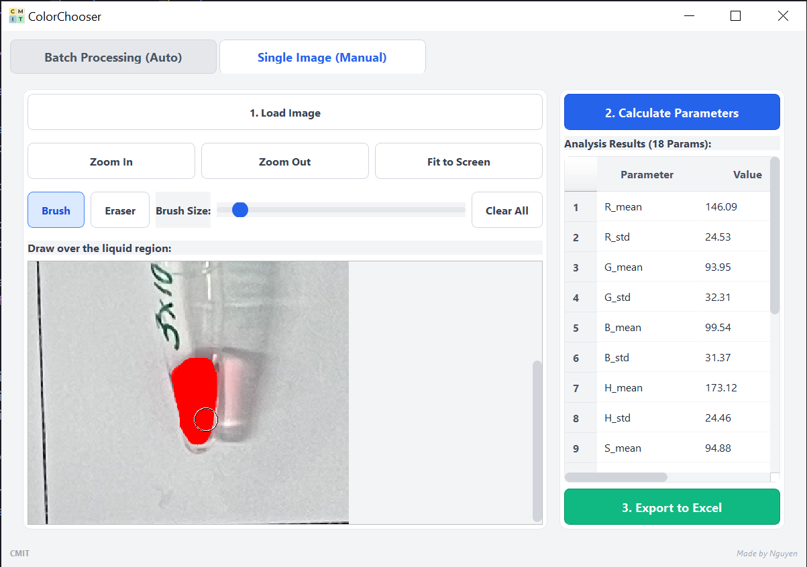
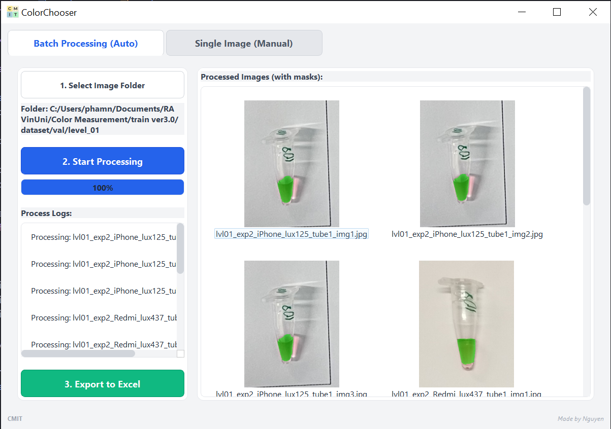

# ColorChooser


<p align="center">
  
</p>

## Description

**ColorChooser** is a powerful and intuitive desktop application designed to assist users in analyzing and extracting colors from images. The repository provides the complete source code for developers who want to modify or build upon the project, as well as a pre-packaged standalone application in the `app` folder for end-users who want to use the software quickly without setting up a development environment.

This tool is specifically tailored for designers, researchers, and developers who need to accurately sample colors from media, process visual data, and export comprehensive color reports for further analysis.

## Features

- **Color Extraction:** Robust color analysis and extraction from images and videos powered by OpenCV.
- **Data Export:** Seamlessly store and export color data reports into Excel formats using Openpyxl and Pandas.
- **User-Friendly Interface:** A clean, modern graphical user interface built with PySide6 for an optimal user experience.
- **Quick Run:** A pre-packaged, ready-to-use version is available for users who do not wish to install Python and dependencies.

## Prerequisites / Requirements

If you plan to run the application from the source code, please ensure you have the following installed:

- **Python:** Version 3.8 or higher.
- All required libraries are listed in `requirements.txt`:
  - `PySide6`
  - `opencv-python`
  - `numpy`
  - `pandas`
  - `openpyxl`

## Installation

You can install and use ColorChooser in two different ways, depending on your needs:

### Method 1: Quick Use (No Installation Required)
For users who just want to use the application without setting up a Python environment:
1. Navigate to the `app` folder within this repository.
2. Download and extract the archive: `ColorChooser_v1.rar`.
3. Run the executable file inside the extracted folder to launch the application.

### Method 2: From Source Code
For developers or those who want to run the raw Python code:
1. **Clone the repository:**
   ```bash
   git clone <your-repository-url>
   cd App_colour
   ```
2. **Create and activate a virtual environment (Recommended):**
   ```bash
   # Windows
   python -m venv venv
   .\venv\Scripts\activate
   
   # macOS/Linux
   python3 -m venv venv
   source venv/bin/activate
   ```
3. **Install the required dependencies:**
   ```bash
   pip install -r requirements.txt
   ```

## Usage

If you have installed the application from the source code, you can start the program by running:

```bash
python main.py
```

### Usage Modes

The application supports two primary ways of processing:

#### 1. Single Process Mode
Use this mode to analyze and pick colors from an individual image or video.

<p align="center">
  
</p>

#### 2. Batch Process Mode
Use this mode to process multiple files or batches of items simultaneously.

<p align="center">
  
</p>

## Project Structure

```text
App_colour/
├── app/                # Pre-packaged application; just extract the .rar to use
├── core/               # Core functionalities (OpenCV image processing, calculations)
├── ui/                 # User interface source code (style.qss, main_window.py, etc.)
├── main.py             # Main entry point to launch the application from source
├── requirements.txt    # List of required Python dependencies
└── LogoColorChoose.png # Application logo
```

## Author & Contributing

**Developed by:** CMIT VinUni

We welcome contributions! If you would like to contribute to ColorChooser:
1. Fork the repository.
2. Create a new branch for your feature (`git checkout -b feature/AmazingFeature`).
3. Commit your changes (`git commit -m 'Add some AmazingFeature'`).
4. Push to the branch (`git push origin feature/AmazingFeature`).
5. Open a Pull Request.

If you encounter any issues or have suggestions, please feel free to report them via the Issues tab.

## License

This project is licensed under the MIT License - see the LICENSE file for details. (If this is an internal project, please update this section with your specific proprietary or internal use terms).
